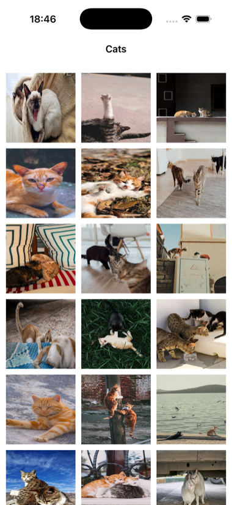
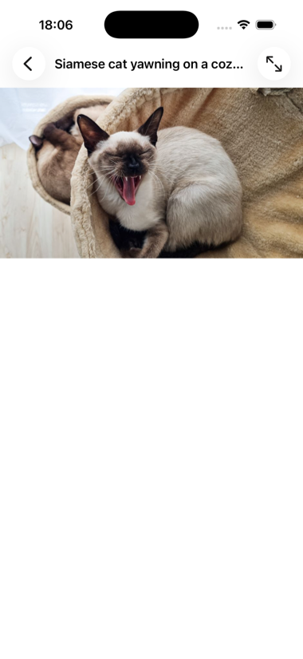

# Cats

An iOS app that shows a scrolling gallery of cat photos from the
[Pexels API](https://www.pexels.com/api/documentation/). Tap one to open it
fullscreen, where you can pinch or double-tap to zoom.

Written in UIKit with no third-party dependencies.

| Gallery | Fullscreen |
| --- | --- |
|  |  |

## Running it

The Pexels API needs a key. They are free and issued immediately at
[pexels.com/api](https://www.pexels.com/api/).

The app reads the key from an `API_KEY` environment variable. Keep it in a
`.env` file at the root of the project, which is listed in `.gitignore` and
must never be committed:

```
API_KEY=your_key_here
```

Then give it to the app one of two ways.

**From Xcode** — Product → Scheme → Edit Scheme → Run → Arguments, and add
`API_KEY` under Environment Variables. That lives in your own scheme data,
which git ignores.

**From the command line** — build, install, and pass it through to the
simulator:

```sh
set -a && . ./.env && set +a
xcodebuild build -project Cats.xcodeproj -scheme Cats \
  -destination 'platform=iOS Simulator,name=iPhone 17' -derivedDataPath build
xcrun simctl install booted build/Build/Products/Debug-iphonesimulator/Cats.app
SIMCTL_CHILD_API_KEY="$API_KEY" xcrun simctl launch booted tech.wcorp.Cats
```

Without a key the app still launches, and shows the error the API returns.

## How it fits together

MVVM, with the network layer behind a protocol so it can be swapped in tests.

```
Cats/
├── Coordinators/   presenting the fullscreen view
├── Extensions/     UICollectionView reuse-identifier plumbing
├── Model/          Cat, the Pexels response types, ServiceError
├── Networking/     ServiceProviding, ServiceProvider, ImageDownloadManager
├── ViewModels/     CatsViewModel
└── Views/          CatsViewController, FullscreenImageViewController,
                    CatImageCell, CatsCollectionViewLayout
```

`CatsViewModel` is `@MainActor` and fetches with `async`/`await`. It talks to
the screen through `CatsGalleryView`, which `CatsViewController` implements,
and holds it weakly.

`ImageDownloadManager` caches downloaded images in three places: an in-memory
dictionary, `URLCache`, and Core Data, so photos survive a relaunch.

## Tests

```sh
xcodebuild test -project Cats.xcodeproj -scheme Cats \
  -destination 'platform=iOS Simulator,name=iPhone 17' -only-testing:CatsTests
```

`CatsTests` covers the view model against a stubbed provider, so no network
or API key is involved. CI runs the same command on every push.

## Credits

Photos come from [Pexels](https://www.pexels.com), free to use under the
[Pexels licence](https://www.pexels.com/license/). Each photo's own
description is shown as its title in the fullscreen view, and where a photo
has none, its photographer is credited there instead.
